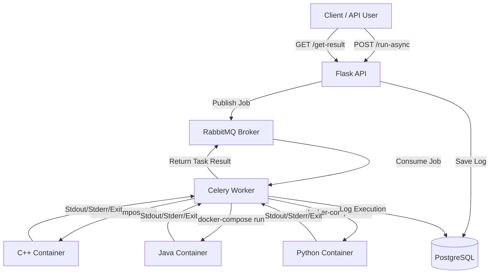

# Code Runner as a Service

A distributed backend service for securely executing untrusted code in isolated container environments.


---

## Overview

Executing untrusted user-submitted code is a fundamental challenge for online platforms like LeetCode or HackerRank. A code execution service must securely isolate untrusted input, prevent resource exhaustion, and scale horizontally to handle concurrent submissions without blocking the main API layer.

Code Runner as a Service is a distributed system designed to solve these challenges. It leverages a Flask-based REST API to receive submissions, offloads them to a RabbitMQ message broker, and processes them asynchronously using Celery workers. The workers execute the code within language-specific, ephemeral Docker containers that enforce memory and execution time limits.

By decoupling the API from the actual execution engine, the architecture remains highly responsive and can scale worker nodes independently of the web layer.

## Key Features

- **Multi-language Execution:** Supports C++, Java, and Python.
- **Docker-based Isolation:** Code is executed in ephemeral, language-specific containers.
- **Resource Constraints:** Enforces a 512 MB memory limit and dynamic language-specific CPU time limits.
- **Asynchronous Processing:** RabbitMQ and Celery enable non-blocking job execution.
- **Synchronous & Asynchronous APIs:** Supports both blocking wait and polling-based execution tracking.
- **Stateless Execution:** Containers are immediately destroyed after execution.

## Architecture



## Execution Flow

The typical lifecycle of an asynchronous code submission is as follows:

1. **Submission:** The client submits source code, language preference, and input parameters to the Flask API (`/run-async`).
2. **Job Queuing:** The API validates the payload, generates a unique Task ID, and publishes the execution job to RabbitMQ.
3. **Response:** The API immediately returns the Task ID to the client.
4. **Task Consumption:** A Celery worker consumes the job from the queue.
5. **Environment Preparation:** The worker writes the source code and standard input to a temporary shared volume.
6. **Execution:** The worker spawns an ephemeral Docker container for the requested language via `docker-compose run --rm`.
7. **Resource Enforcement:** The container enforces memory limits (512 MB) and a CPU time limit (using GNU `timeout`).
8. **Result Capture:** Standard output (stdout), standard error (stderr), and exit codes are captured by the worker.
9. **Persistence:** The worker records execution metadata (duration, state, error reason) in PostgreSQL and persists the final output to the Celery result backend.
10. **Cleanup:** The temporary files are deleted and the container is destroyed.
11. **Retrieval:** The client polls the `/get-result` endpoint to retrieve the execution output.

## Why RabbitMQ + Celery?

Executing code synchronously inside an HTTP request handler is an anti-pattern. Compilation and execution are long-running, CPU-bound processes. If executed synchronously, an influx of requests would quickly exhaust the web server's thread pool, leading to timeouts and cascading failures.

By introducing **RabbitMQ** and **Celery**:
- **Decoupling:** The API simply accepts work and delegates it, remaining highly responsive.
- **Backpressure:** Sudden spikes in submissions are buffered in the queue rather than crashing the system.
- **Fault Isolation:** If a worker crashes due to a malicious submission, the API is unaffected.
- **Horizontal Scalability:** We can trivially scale the execution capacity by adding more Celery worker nodes without touching the web layer.

## Sandboxed Execution

Submitting arbitrary code poses severe security risks, including host compromise, network scanning, and denial-of-service via resource exhaustion (e.g., fork bombs or memory leaks). 

To mitigate these risks, executions are sandboxed inside Docker containers with strict constraints:

| Control | Implementation |
|---|---|
| **Execution isolation** | Ephemeral Docker containers (`docker-compose run --rm`) |
| **Memory limit** | 512 MB hard limit (enforced via `docker-compose.yml`) |
| **CPU/time limit** | Enforced via GNU `timeout` (Base limit * Language multiplier: Python 5x, Java 2x, C++ 1x) |
| **Supported languages** | C++ (g++), Java (javac/java), Python (python) |
| **Output capture** | Combined stdout/stderr via `2>&1` pipe in wrapper scripts |
| **Host access** | Bound to isolated Docker network; code files mounted via read-only/temporary bindings |

### Security Considerations

While Docker provides a baseline level of isolation via namespaces and cgroups, it does not provide the same security boundaries as a hypervisor. Advanced sandboxing mechanisms (like seccomp, AppArmor, or gVisor) are documented in the [Security Hardening Roadmap](#security-hardening-roadmap) for future implementation.

## API

| Method | Endpoint | Purpose |
|---|---|---|
| `POST` | `/run` | Submits code for synchronous execution (blocks until completion) |
| `POST` | `/run-async` | Submits code for asynchronous execution and returns a Task ID |
| `GET`  | `/get-result/<task_id>` | Retrieves the status and result of an asynchronous execution |

### Example

**1. Submit Code**

```bash
curl -X POST http://localhost:5000/run-async \
     -H "Content-Type: application/json" \
     -d '{
           "data": {
               "language": "py",
               "code": "print(\"Hello from Python!\")",
               "code_input": "",
               "time_limit": 1
           }
         }'
```

**Response:**
```json
{
  "data": {
    "task_id": "4b68e9f2-2b31-4c75-8025-8a8b11c463f6"
  }
}
```

**2. Retrieve Result**

```bash
curl http://localhost:5000/get-result/4b68e9f2-2b31-4c75-8025-8a8b11c463f6
```

**Response:**
```json
{
  "data": {
    "result": "Hello from Python!\n"
  }
}
```

## Performance / Capacity

The architecture was designed with scalability in mind. The following metrics represent the **architectural design targets** of the distributed worker model (Note: project-level benchmark figures are documented theoretically and are not automatically reproduced by the repository scripts).

### Design Goals

| Metric | Target |
|---|---:|
| **Concurrent jobs** | 50 concurrent |
| **Submission throughput** | ~200 submissions/min |
| **Queue latency** | < 100ms |

## Deployment

The system is containerized for easy deployment. It uses `docker-compose` to orchestrate the services:
- **Code Runner API:** Served via Gunicorn (WSGI).
- **RabbitMQ:** Configured as the message broker.
- **PostgreSQL:** Stores execution metadata logs.
- **Celery Workers:** Consume and execute tasks using nested Docker execution strategies.

*(Note: Production deployment via AWS EC2 and Nginx reverse proxy is part of the future scaling roadmap).*

## Project Structure

```text
.
├── code_runner/          # Flask application, routing, and database models
├── runner/               # Dockerfiles and docker-compose configurations for execution sandboxes
├── shell_scripts/        # Worker invocation wrappers and environment setup scripts
├── tasks/                # Celery configuration and worker task definitions
├── .env.development.local# Environment variables and configuration 
├── docker-compose.yml    # Primary orchestration for API, MQ, and DB
└── wsgi.py               # WSGI entry point for the Flask server
```

## Technology Decisions

| Technology | Why it is used |
|---|---|
| **Flask** | Lightweight WSGI web application framework ideal for building fast API endpoints. |
| **RabbitMQ** | Robust, AMQP-compliant message broker to safely queue code execution tasks. |
| **Celery** | Distributed task queue that natively integrates with RabbitMQ for worker execution. |
| **Docker** | Provides standardized environment packaging and fundamental process isolation for untrusted code. |
| **Gunicorn** | Production-grade WSGI HTTP Server to serve the Flask application concurrently. |
| **PostgreSQL** | Relational database to durably persist execution metadata and performance logs. |

## Scalability

The current architecture scales horizontally. As submission volume increases:
1. **API Scalability:** The stateless Flask API can be scaled horizontally behind a load balancer (e.g., Nginx).
2. **Worker Scalability:** Celery workers can be dynamically added to other nodes. Since tasks are state-independent and code is passed via the broker, workers simply connect to RabbitMQ and begin processing tasks.

### Current Architecture vs Future Scaling

To reach massive scale, the system is designed to evolve toward:
- **Kubernetes:** Orchestrating API pods and autoscaling Celery workers based on RabbitMQ queue depth (KEDA).
- **Distributed Result Storage:** Using Redis for high-throughput task result retrieval instead of the primary PostgreSQL DB.

## Engineering Trade-offs

### Containers vs Virtual Machines
Docker containers were chosen over full Virtual Machines for execution sandboxes because they offer millisecond startup times and drastically lower memory overhead. The trade-off is a shared host kernel, which presents a larger attack surface than hardware-level VM isolation.

### Queue-Based vs Direct Execution
By using RabbitMQ, we introduce system complexity (managing a broker, worker nodes, and task states) but gain fault tolerance and backpressure. Direct execution would be simpler but would collapse under heavy concurrent load.

## Failure Handling

The system gracefully handles several failure states:
- **Timeouts:** If a user's code infinite-loops, the GNU `timeout` utility forcefully kills the process and returns a `Time Limit Exceeded` state.
- **Compilation/Syntax Errors:** Errors during `javac` or `g++` compilation, or Python parsing, are caught, logging a `syntax_or_runtime` error state, and the compiler output is returned to the user.
- **Invalid Input:** The Flask API strictly validates the JSON payload. Missing keys or unsupported languages result in an immediate `422 Unprocessable Entity` HTTP response.

### Known Limitations
- The system currently deletes code source files after execution, meaning retrospective auditing of malicious payloads is not possible.
- If a Celery worker dies *during* a task (e.g., OOM killed by the OS), the task may remain in a pending state until a visibility timeout is reached.

## Security

Running arbitrary code from the internet is dangerous. The system implements:
- **Resource Exhaustion Protection:** 512MB RAM limits prevent OOM crashing the host. Time limits prevent CPU hogging.
- **Filesystem Isolation:** The container has no access to the host machine's filesystem outside of the temporary bind mount for the specific script being executed.

### Security Hardening Roadmap
Future work to achieve true "production-grade" sandboxing includes:
- **gVisor / Firecracker:** Wrapping containers in user-space kernels or micro-VMs to prevent kernel exploit escapes.
- **Network Isolation:** Disabling internet access within the execution containers (`--network none`) so malicious code cannot act as a botnet or exfiltrate data.
- **Read-Only Root Filesystem:** Preventing code from writing to anywhere except standard output.
- **Unprivileged Execution:** Running the execution container as a non-root user.

## What I Learned

Building this service provided deep experience in **distributed systems architecture**. Key learnings included:
- Designing asynchronous systems where the API immediately responds and clients poll for state.
- Managing message brokers (RabbitMQ) to decouple submission ingestion from heavy compute tasks.
- Enforcing resource limits inside Linux environments and managing ephemeral container lifecycles programmatically.
- Handling race conditions, timeouts, and process cleanup for untrusted workloads.

## Future Improvements

- **Automated Testing:** Implement a suite of unit and integration tests (using `pytest`) covering the core execution paths.
- **Observability:** Integrate Prometheus and Grafana for monitoring queue depths and execution latency.
- **Rate Limiting:** Implement per-user API rate limiting to prevent abuse.
- **Infrastructure as Code:** Add Ansible playbooks and GitHub Actions workflows for automated CI/CD and deployment to AWS.
- **Robust Sandboxing:** Migrate execution environments to gVisor.

## Running Locally

### Prerequisites
- Python 3.8+
- Docker and Docker Compose
- RabbitMQ
- PostgreSQL

### Environment Variables
Create a `.env.development.local` file in the root directory:
```env
ENV=development
DATABASE_USERNAME=postgres
DATABASE_PASSWORD=your_password
DATABASE_HOST=localhost
DATABASE_NAME=code_runner
CELERY_BROKER_HOST=localhost
CELERY_BROKER_PORT=5672
CELERY_BROKER_USER=guest
CELERY_BROKER_PASSWORD=guest
```

### Installation & Setup (Without Docker)

1. **Create and activate a virtual environment:**
   ```bash
   python3 -m venv env
   source env/bin/activate
   ```
2. **Install dependencies:**
   ```bash
   pip3 install -r code_runner/requirements/requirements.txt
   ```
3. **Initialize the database:** Ensure PostgreSQL is running, create a database named `code_runner`, and update the `.env` file with your credentials.
4. **Initialize RabbitMQ:** Ensure RabbitMQ is running on your machine.

### Starting the API

Start the Flask application using Gunicorn or the development server:
```bash
python3 wsgi.py
```
The API will be available at `http://localhost:5000`.

### Starting Workers

In a separate terminal (with the virtual environment activated), start the Celery worker:
```bash
celery -A tasks worker --loglevel=DEBUG
```

### Note on Testing
Testing is not currently implemented in this repository. Validating the system requires manually running the API endpoints as shown in the Example section.

---

## Repository Documentation Notes

*This section details inconsistencies observed between intended architecture descriptions and the current state of the repository:*
- The stated memory limit of 256MB is actually configured as 512MB in `docker-compose.yml`.
- The time limit is dynamically passed in the request and scaled by language (e.g. 5x for Python) rather than a hardcoded 5 seconds.
- The project documentation mentioned 35 unit tests, but there are no automated tests present in the repository.
- There are exactly 3 REST API endpoints (`/run`, `/run-async`, `/get-result`), not 10+.
- AWS EC2, Ansible, and Nginx configurations are not present in the repository, and have been documented as future improvements rather than existing infrastructure.
- Benchmark claims (50 concurrent, 200/min) lack verification scripts in the codebase and are documented strictly as design targets.
